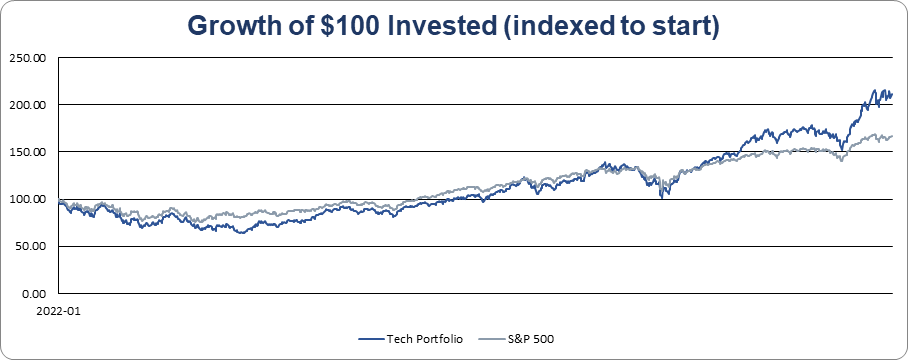
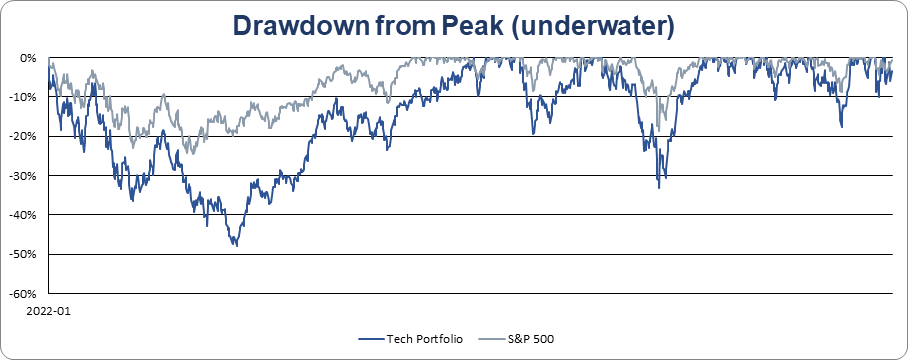
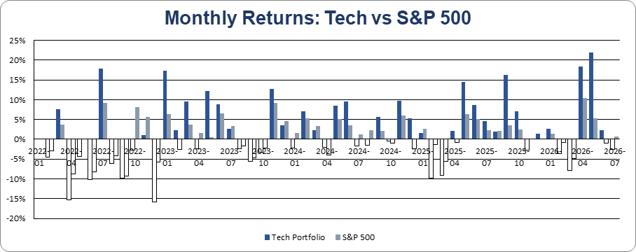

# Portfolio Risk Analysis — Concentrated Tech vs. the S&P 500

Does the standard advice — *"just buy the S&P 500 and don't bother picking stocks"* — actually
hold up? I tested it with data: a concentrated basket of 9 popular large-cap tech names against
the S&P 500 over ~4.5 years (Jan 2022 – Jul 2026), comparing them on **return, risk, and
risk-adjusted return** rather than headline performance alone.

## Key Findings

The concentrated portfolio **beat the index on return** and was even **slightly better
risk-adjusted** — but it paid for it with far more volatility and a much deeper drawdown.
The case for the index isn't higher returns; it's getting *most* of the reward with *far less
pain* and zero research effort.

| Metric | Tech Portfolio | S&P 500 | Takeaway |
|---|---:|---:|---|
| Annualized return (CAGR) | **21.7%** | 12.1% | Tech won on raw return |
| Annualized volatility | 30.7% | **17.6%** | Index was far calmer |
| Sharpe ratio (rf = 2%) | **0.64** | 0.57 | Tech edged it, risk-adjusted |
| Max drawdown | −47.8% | **−24.5%** | Index fell about half as far |
| Growth of $100 | **$242** | $167 | — |

## Charts

**Growth of $100 invested (indexed to a common start)**



**Drawdown from peak — the "pain" chart**



**Monthly returns — tech swings noticeably harder**



## Method

1. **Data** — daily closing prices for the 9 holdings and SPY, 2022–2026.
2. **SQL structuring** — window functions turn raw prices into a clean metrics series:
   - `LAG()` for the previous day's value → daily returns
   - a running `MAX() OVER (... ROWS UNBOUNDED PRECEDING)` for the peak → the drawdown series
   - See [`sql/`](sql/) — `createtable.sql`, `dailyreturnpct.sql`, `drawdown.sql`.
3. **Excel** — the structured series feed live-formula risk metrics: CAGR, annualized volatility
   (daily-return stdev × √252), Sharpe vs. a 2% risk-free rate, and max drawdown. See
   [`excel/Portfolio_Risk_Analysis.xlsx`](excel/Portfolio_Risk_Analysis.xlsx).

Both series are indexed to $100 at the start so the growth chart is a like-for-like comparison;
all risk metrics are scale-free and unaffected by the starting amount.

## Holdings

Concentrated basket of 9 large-cap names, benchmarked against SPY (S&P 500 ETF).
NVDA · AMZN · MSFT · GOOGL · TSLA · AAPL · TSM · MU · HOOD — full share counts in
[`data/holdings.csv`](data/holdings.csv).

## Repo structure

```
portfolio-risk-analysis/
├── README.md
├── data/
│   └── holdings.csv                 # tickers + share counts
├── sql/
│   ├── createtable.sql              # builds the holdings table
│   ├── dailyreturnpct.sql           # daily portfolio value + daily returns (LAG)
│   └── drawdown.sql                 # drawdown from running peak (MAX window)
├── excel/
│   └── Portfolio_Risk_Analysis.xlsx # Summary, Charts, Holdings, daily data, monthly returns
└── images/
    ├── growth.png
    ├── drawdown.png
    └── monthly_returns.png
```

## Limitations

- **Hindsight bias.** These names were chosen *knowing* they had done well, which inflates the
  tech result. A fairer test would select names without knowing the outcome (e.g. the top 10 by
  market cap as of the start date, held fixed).
- **Buy-and-hold, no rebalancing**, no transaction costs, no dividends reinvested on the single
  names.
- **Portfolio excludes SPY.** SPY is used only as the benchmark, not counted as a holding — so the
  portfolio is the 9 stock picks alone, compared against the S&P 500.

## Tools

SQL (window functions) · Excel (live-formula risk metrics & charting)
